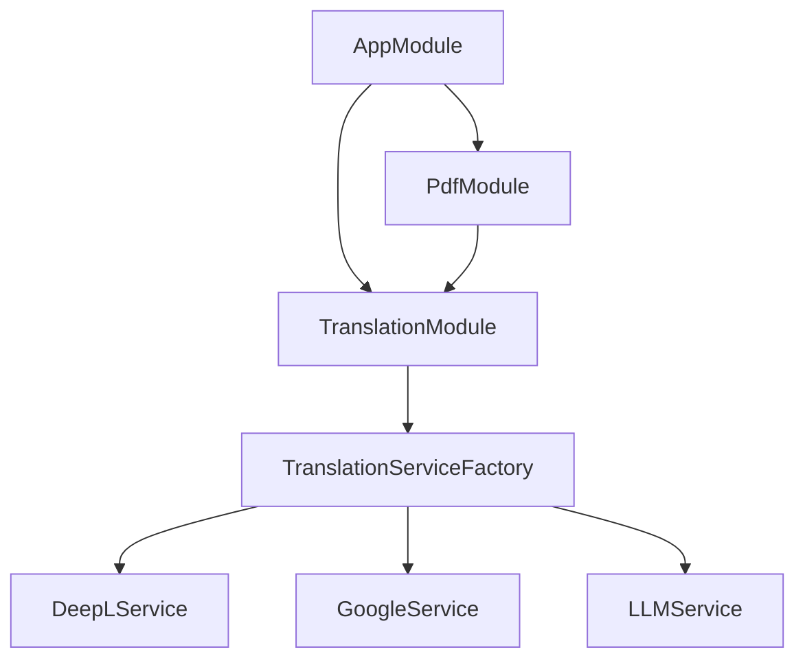
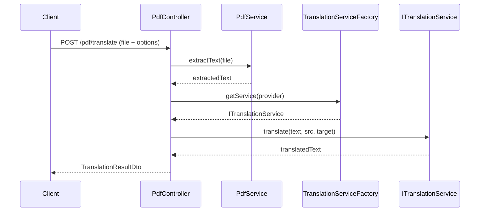

# Architecture

## 모듈 의존성



## 어댑터 패턴

모든 번역 서비스는 `ITranslationService` 인터페이스를 구현합니다.

```typescript
interface ITranslationService {
  translate(text: string, sourceLang: string, targetLang: string): Promise<string>;
  getSupportedLanguages(): Promise<string[]>;
}
```

- **DeepLService** — DeepL API 어댑터
- **GoogleService** — Google Translate API 어댑터
- **LLMService** — LLM(Claude 등) 기반 번역 어댑터
- **TranslationServiceFactory** — `TRANSLATION_PROVIDER` 환경변수(`deepl` | `google` | `llm`)를 읽어 런타임에 적절한 어댑터를 반환

## 요청 흐름



## 환경변수

| 키 | 설명 | 기본값 | 필수 |
|----|------|--------|------|
| `NODE_ENV` | 실행 환경 | `development` | N |
| `PORT` | 서버 포트 | `3000` | N |
| `UPLOAD_DIR` | 업로드 파일 저장 경로 | `./uploads` | N |
| `MAX_FILE_SIZE` | 최대 파일 크기 (bytes) | `10485760` (10MB) | N |
| `DEEPL_API_KEY` | DeepL API 키 | — | DeepL 사용 시 Y |
| `GOOGLE_TRANSLATE_API_KEY` | Google Translate API 키 | — | Google 사용 시 Y |
| `GITHUB_TOKEN` | GitHub Fine-Grained Token | — | N |
| `GITHUB_REPO` | GitHub 레포지토리 (`owner/repo`) | — | N |
