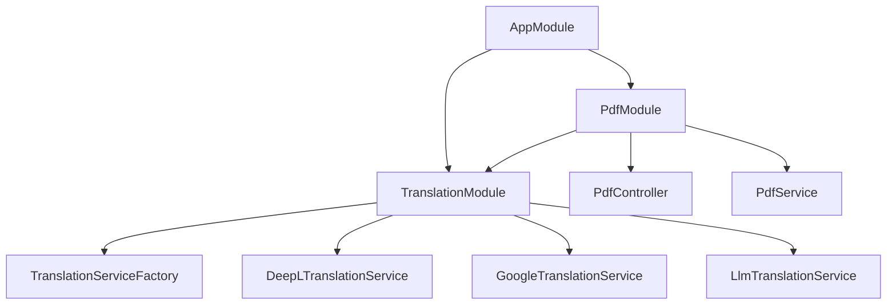
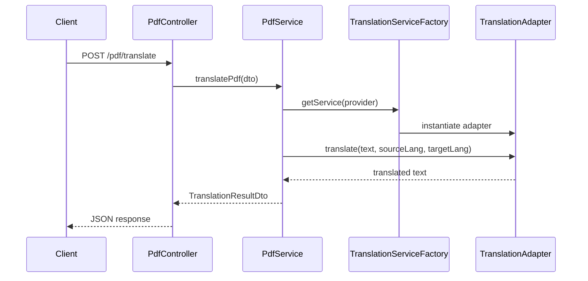

# Architecture

## Module Dependency Graph



## Request Sequence



## Adapter Pattern

The translation system uses the **Adapter Pattern** to support multiple translation services without changing client code.

```
ITranslationService (interface)
├── DeepLTranslationService
├── GoogleTranslationService
└── LlmTranslationService
```

`TranslationServiceFactory` selects the correct adapter based on the `provider` field in the request.

## Environment Variables

| Variable | Required | Default | Description |
|----------|----------|---------|-------------|
| `PORT` | No | `3000` | HTTP server port |
| `NODE_ENV` | No | `development` | Runtime environment |
| `UPLOAD_DIR` | No | `./uploads` | Directory for uploaded PDFs |
| `MAX_FILE_SIZE` | No | `10485760` | Max upload size in bytes (10MB) |
| `DEEPL_API_KEY` | Yes* | — | DeepL API key (*required for DeepL provider) |
| `GOOGLE_TRANSLATE_API_KEY` | Yes* | — | Google Translate API key (*required for Google provider) |
| `GITHUB_TOKEN` | No | — | GitHub token for optional integrations |
| `GITHUB_REPO` | No | — | GitHub repo for optional integrations |
