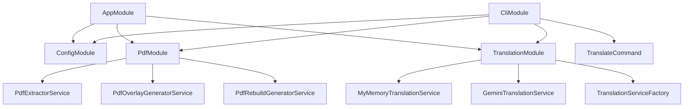
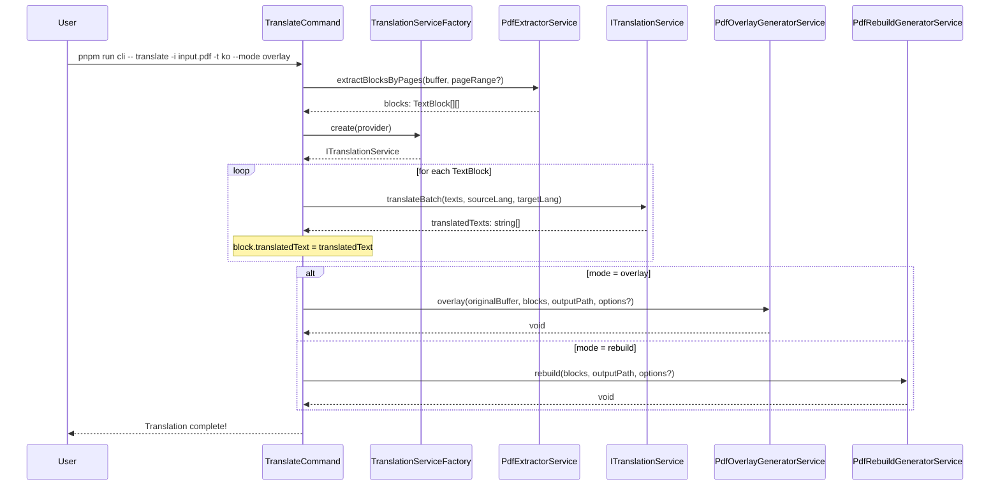
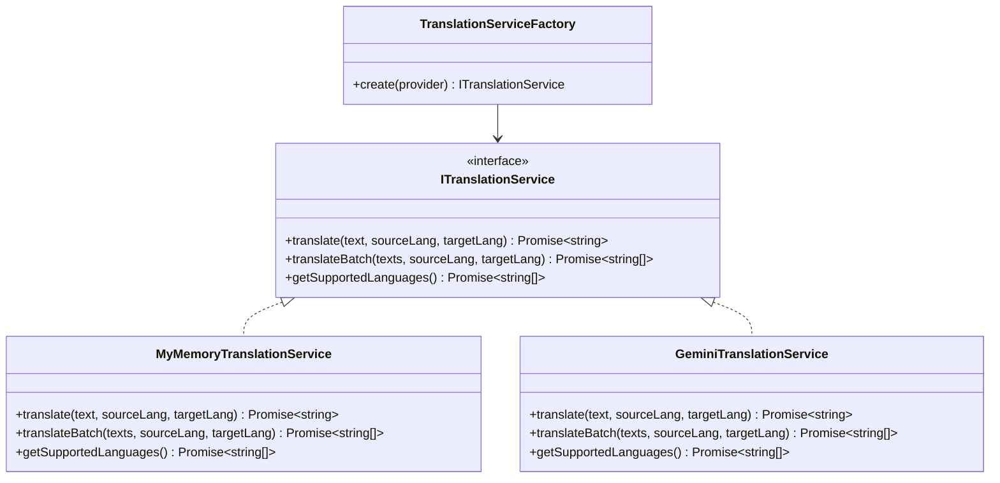
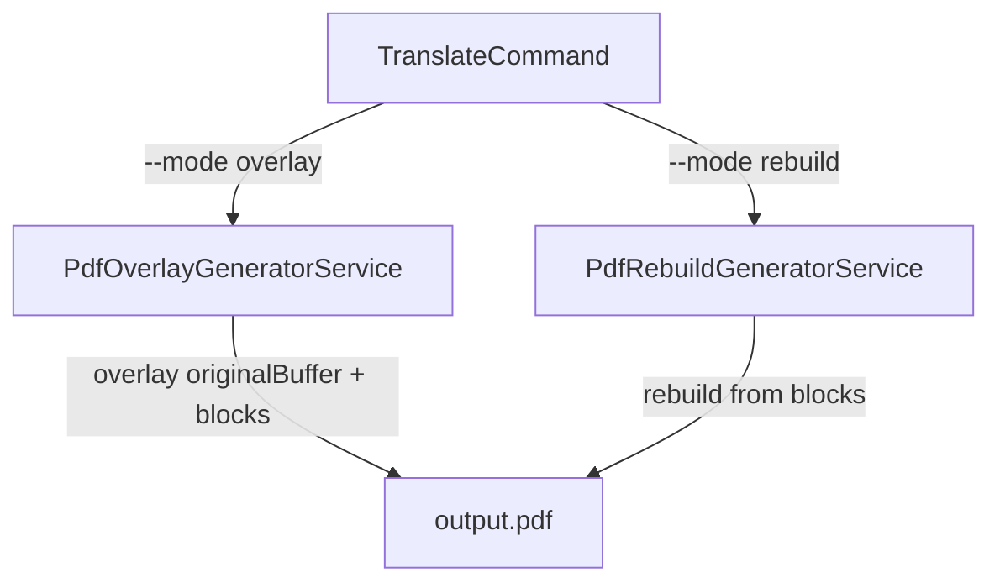

# Architecture

## Module Dependency Graph

## TextBlock Data Flow

## Adapter Pattern

번역 서비스는 어댑터 패턴으로 구현되어 있어 쉽게 교체 가능합니다.

## PDF Generation Strategy

## Environment Variables Reference

| Variable | Description | Required | Default |
|----------|-------------|----------|---------|
| `NODE_ENV` | Runtime environment | No | `development` |
| `UPLOAD_DIR` | Directory for uploaded files | No | `./uploads` |
| `MAX_FILE_SIZE` | Maximum upload file size in bytes | No | `10485760` (10MB) |
| `GEMINI_API_KEY` | Google Gemini API key | T-2+ | - |
| `PORT` | HTTP server port (Phase 3+) | Phase 3+ | `3000` |
